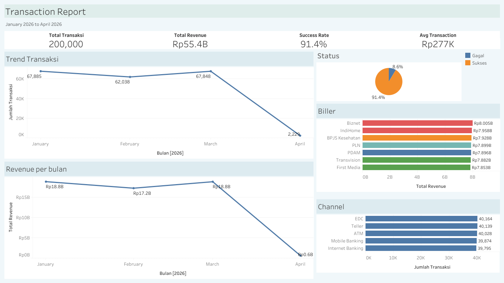
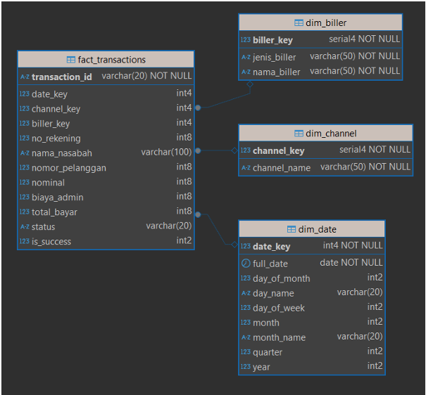

# Biller Analytics Pipeline

**Excel → PostgreSQL → star schema → Tableau.** 200,000 bill-payment transactions modeled into a dimensional warehouse, with Tableau connected live to the database rather than to a static extract.

**[▶ Open the live dashboard](https://public.tableau.com/views/Book1_17760717152110/TransactionReport)**



---

## Architecture

```
dummy_transaksi_biller_200k.xlsx
            │
            │  Python (pandas + psycopg2, batched 5k inserts)
            ▼
   staging.raw_transactions        ← raw, all columns as-loaded
            │
            │  SQL: date casting, TRIM, NULL handling, derived columns
            ▼
   staging.stg_transactions        ← cleaned + transaction_date_clean / month / year / is_success
            │
            │  SQL: dimension extraction + surrogate keys
            ▼
        dw.* (star schema)  ──────────────►  Tableau (live connection)
```

### Star schema



---

## Decisions & insight

### 1. Status Pending

Data memiliki tiga status (Sukses, Gagal, Pending), tetapi label ingin saya jadikan biner. `is_success = 0` untuk status Gagal dan Pending, karena transaksi Pending belum berhasil dan secara bisnis belum menghasilkan revenue yang confirmed.

### 2. Trend Transaksi

Data mencakup periode Januari–April 2026. Perlu dicatat bahwa data April hanya berisi 
tanggal 1 April saja, sehingga volume transaksi April terlihat sangat rendah di line chart. Ini 
bukan penurunan performa, melainkan keterbatasan data. Untuk analisis trend yang lebih 
akurat, disarankan untuk memfilter data hanya sampai Maret 2026, atau menormalisasi data 
April menjadi proyeksi bulanan penuh.

### 3. Distribusi Channel

Distribusi transaksi antar channel relatif merata. EDC sedikit unggul dengan 40.164 transaksi, 
diikuti Teller, ATM, Mobile Banking, dan Internet Banking. Tidak ada channel yang dominan 
secara signifikan, menunjukkan nasabah menggunakan semua channel secara seimbang.

---