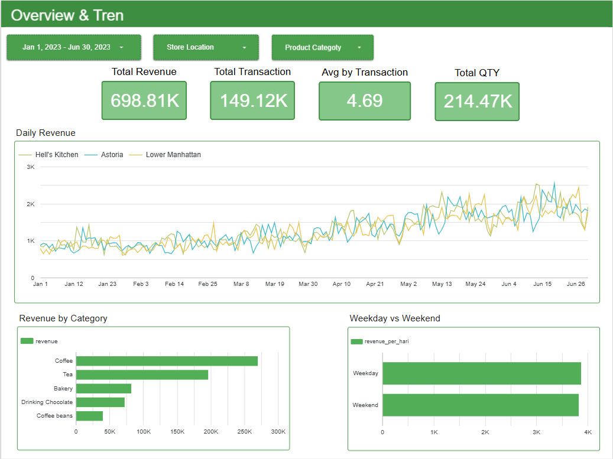
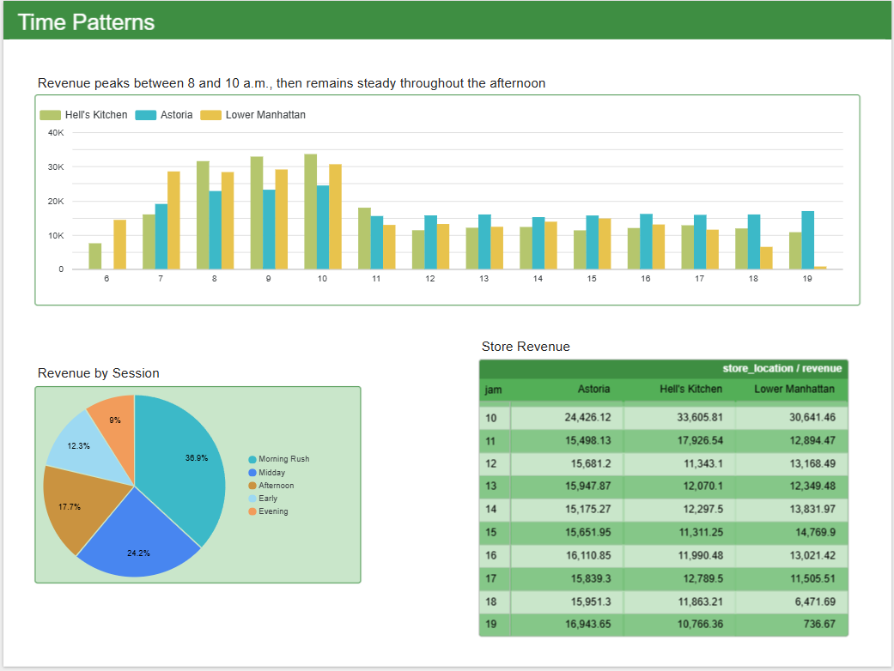
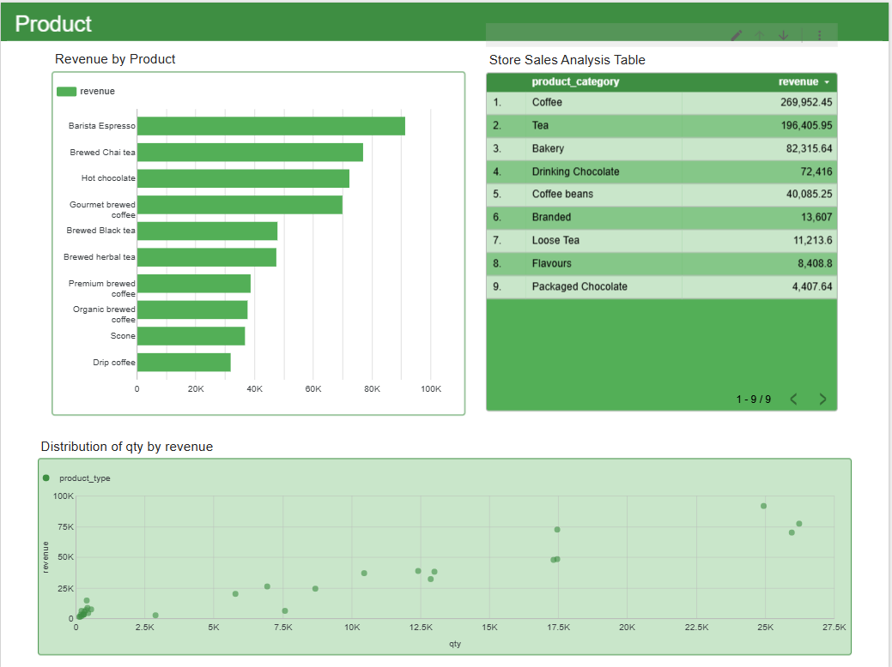

# Coffee Shop Sales Analysis — Google Sheets & Looker Studio

Analisis penjualan tiga toko coffee shop di New York City selama semester pertama 2023, dari data mentah sampai dashboard interaktif. Seluruh proses cleaning, transformasi, dan agregasi dikerjakan **sepenuhnya di spreadsheet**.

**Dashboard:** [\[link Looker Studio\]](https://datastudio.google.com/reporting/dd257a9e-f591-4e20-b7d4-b4c97d23618a)

**Data:** [\[link sheet\]](https://docs.google.com/spreadsheets/d/1a8zQ9O0CKRGdKKLdILwbaG7KI_NHk1yk-NSG-2ocg8U/edit?usp=sharing)

---

## Latar Belakang

Pemilik jaringan coffee shop ingin tahu kapan tokonya paling ramai, produk mana yang benar-benar menggerakkan pendapatan, dan apakah pola akhir pekan berbeda dari hari kerja. Pertanyaan-pertanyaan itu yang mengarahkan seluruh analisis di bawah.

**Dataset:** 149.116 transaksi, Januari–Juni 2023, tiga gerai (Astoria, Hell's Kitchen, Lower Manhattan).

**Tools:** Google Sheets untuk cleaning dan transformasi, Looker Studio untuk visualisasi.

---

## Temuan

### 1. Bisnis tumbuh dua kali lipat dalam enam bulan

| Bulan | Revenue |
|---|---|
| Januari | 81.678 |
| Februari | 76.145 |
| Maret | 98.835 |
| April | 118.941 |
| Mei | 156.728 |
| Juni | 166.486 |

Pertumbuhan Januari ke Juni mencapai **103,8 persen**. Februari adalah satu-satunya bulan yang turun dikarenakan jumlah hari yang lebih sedikit. Sejak Maret, tren naik terus secara konsisten dan pertumbuhan naik secara serentak di ketiga toko.

### 2. Ketiga toko identik performanya

| Toko | Revenue | Per hari |
|---|---|---|
| Hell's Kitchen | 236.511 | 1.306,69 |
| Astoria | 232.244 | 1.283,12 |
| Lower Manhattan | 230.057 | 1.271,03 |

Selisih antara gerai tertinggi dan terendah hanya **2,8 persen**. Dari sini didapat bahwa tidak ada toko yang bermasalah maupun memiliki pola keunggulan tertentu, ketiga toko sama sama stabil walaupun berada pada lokasi dengan karakteristik yang sangat berbeda.`

### 3. Akhir pekan tetap ramai

Secara total, revenue hari kerja jauh lebih banyak ketimbang hari libur. Namun, jika dilihat berdasarkan jumlah hari yang mana pada data ini **130 hari kerja dan hanya 51 hari akhir pekan**, lalu dilakukan normalisasi:

| | Revenue per hari |
|---|---|
| Hari kerja | 3.873,75 |
| Akhir pekan | 3.827,94 |

Selisihnya **di bawah 1,2 persen** yang menandakan toko selalu ramai setiap hari.

### 4. Morning rush mendominasi, siang hari berkurang

Toko beroperasi 06.00–19.00. Revenue melonjak tajam pada 08.00–10.00, lalu turun dan jadi datar sepanjang 12.00–17.00 sebelum akhirnya turun.

Segmen Morning Rush (08.00–11.00) menyumbang **36,7%** revenue hanya dalam rentang tiga jam. Sebagai perbandingan, Midday yang mencakup empat jam menyumbang 24,1%.

Pola ini sama di ketiga toko, yang memperkuat karakter bisnis sebagai coffee shop yang di datangi untuk rutinitas pagi hari seperti kerja dan minum kopi pagi, bukan tempat nongkrong saat sore sepulang kerja.

### 5. Produk terlaris bukan penyumbang revenue terbesar

| Produk | Qty | Revenue |
|---|---|---|
| Brewed Chai tea | 26.250 | 77.082 |
| Gourmet brewed coffee | 25.973 | 70.035 |
| Barista Espresso | 24.943 | 91.406 |
| Hot chocolate | 17.457 | 72.416 |

Brewed Chai tea terjual paling banyak, tetapi **Barista Espresso menghasilkan revenue tertinggi** meski jumlah penjualan lebih rendah. Hot chocolate justru penjualannya hanya 2/3 Chai tea, namun revenue-nya nyaris setara.

Coffee dan Tea bersama-sama menyumbang **67%** total revenue.

---

## Dashboard

### Halaman 1 — Overview & Tren

### Halaman 2 — Pola Waktu

### Halaman 3 — Produk

---