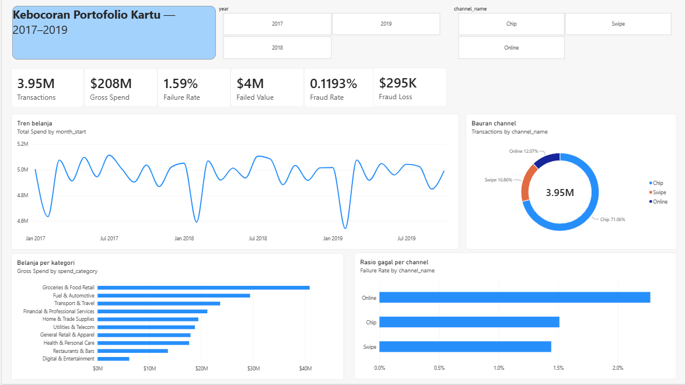
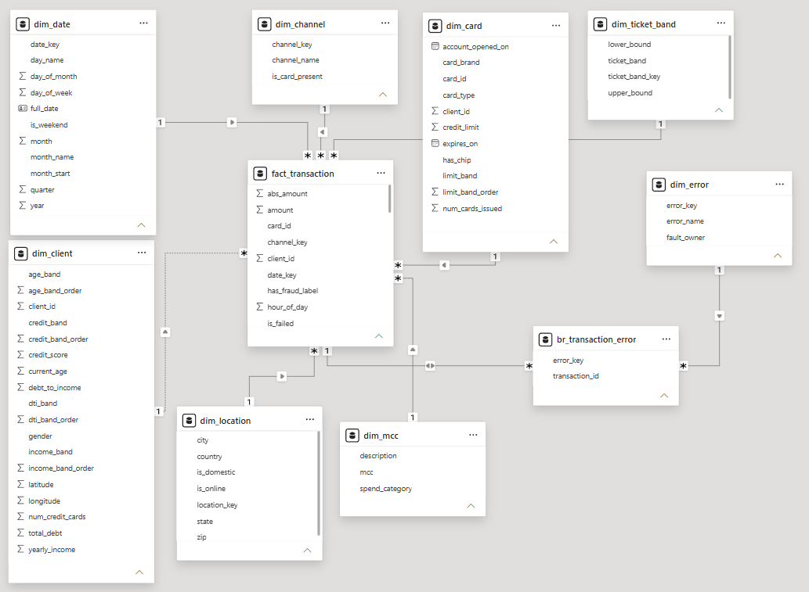
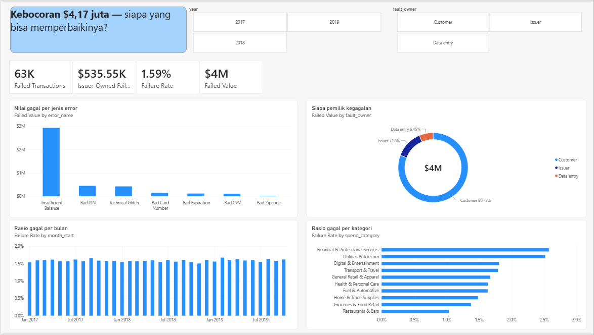
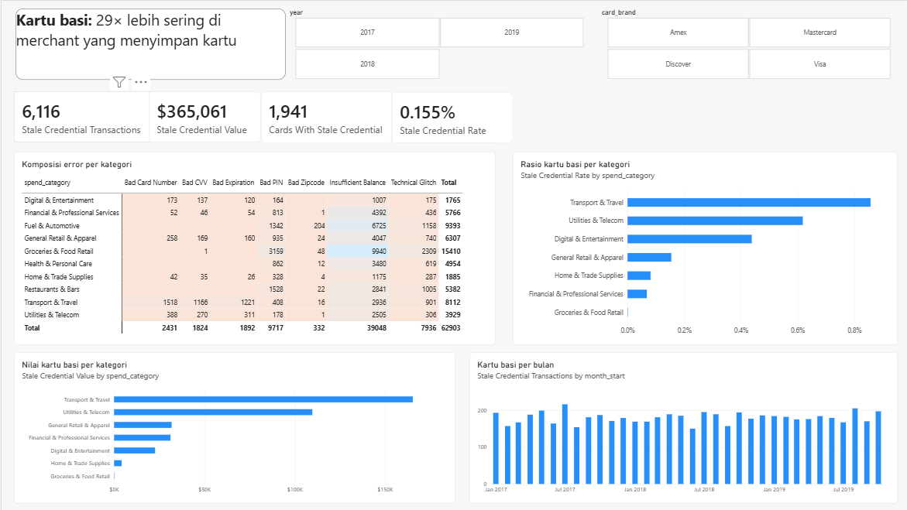
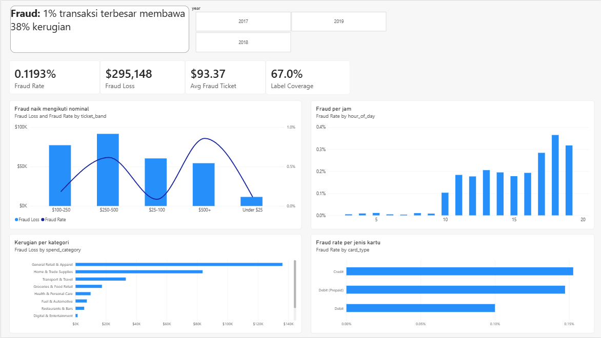

# Kebocoran Portofolio Kartu

**Sebuah bank penerbit kartu kehilangan uang setiap hari dari transaksi yang gagal dan dari penipuan. Berapa besarnya, dan bagian mana yang sebenarnya bisa diperbaiki bank sendiri?**

13,3 juta transaksi kartu tahun 2010–2019 dianalisis untuk menjawab itu. Jawaban singkatnya: dalam tiga tahun terakhir data, **$4,17 juta gagal menjadi transaksi** — tapi hanya **13%** yang benar-benar ada di tangan bank. Sisanya saldo nasabah yang memang tidak cukup, dan tidak ada proses internal yang bisa mengubahnya.



---

## Istilah yang dipakai di sini

Beberapa istilah di laporan ini berasal dari dunia perbankan kartu. Ini artinya dalam bahasa sehari-hari.

**Kebocoran (leakage)**
Uang yang seharusnya menjadi transaksi tapi tidak pernah terjadi. Bayangkan pelanggan sudah di kasir, barang sudah di-scan, lalu kartunya ditolak — transaksi batal. Toko tidak dapat uang, bank tidak dapat komisi, pelanggan pulang dengan kesal. Setiap penolakan seperti itu adalah kebocoran.

**Portofolio kartu**
Kumpulan seluruh kartu yang diterbitkan dan dikelola satu bank. Sama seperti "portofolio saham" berarti kumpulan saham yang dimiliki seseorang. Di data ini: **6.146 kartu milik 2.000 nasabah**.

**Kebocoran portofolio kartu**
Total uang yang lolos dari seluruh kartu itu — baik karena transaksi ditolak, maupun karena dipakai penipu.

**Kredensial kartu**
Data yang dipakai untuk membayar: nomor kartu, tanggal kedaluwarsa, dan CVV (tiga angka di belakang kartu). "Kredensial" berarti bukti identitas — dalam hal ini, identitas kartu Anda.

**Kredensial basi / kartu basi**
Merchant tertentu **menyimpan** nomor kartu Anda supaya bisa menagih otomatis tiap bulan: langganan streaming, tagihan listrik, kartu tol, tiket pesawat.

Lalu kartu Anda diganti — hilang, kedaluwarsa, atau dicuri. Bank mengirim kartu baru dengan **nomor baru**. Tapi merchant masih memegang nomor lama. Bulan depan tagihan otomatis itu ditolak, padahal saldo Anda cukup dan tidak ada yang salah dengan Anda.

Itulah kredensial basi: data kartu yang tersimpan di merchant sudah kedaluwarsa, tapi masih dipakai menagih. Dalam data ini muncul sebagai tiga jenis penolakan — *Bad Card Number*, *Bad CVV*, *Bad Expiration*.

**Fraud (penipuan kartu)**
Transaksi yang dilakukan orang lain memakai kartu nasabah tanpa izin.

**Card testing**
Trik penipu: sebelum membelanjakan kartu curian dalam jumlah besar, mereka mencoba transaksi kecil dulu — beberapa dolar saja — untuk menguji apakah kartunya masih aktif. Kalau lolos, baru dipakai besar-besaran.

---

## Datanya dari mana

[Financial Transactions Dataset](https://www.kaggle.com/datasets/computingvictor/transactions-fraud-datasets) dari Kaggle — **data sintetis** buatan IBM yang meniru perilaku transaksi kartu di Amerika Serikat.

| | |
|---|---|
| Transaksi | 13.305.915 baris, Januari 2010 – Oktober 2019 |
| Nasabah | 2.000 orang, lengkap dengan umur, penghasilan, utang, skor kredit |
| Kartu | 6.146 kartu — Visa, Mastercard, Amex, Discover; kredit, debit, prepaid |
| Merchant | 25.425 lokasi di 50 negara bagian, plus transaksi online |
| Kategori | 109 kode MCC (kode jenis usaha merchant), dikelompokkan jadi 10 kategori belanja |
| Label fraud | 8,9 juta transaksi ditandai fraud/bukan — **67% dari total, bukan semuanya** |

Data ini dipilih justru karena berantakan secara realistis: nominal bercampur simbol dolar, satu transaksi bisa gagal karena beberapa alasan sekaligus, dan kolom alasan penolakan berisi teks yang dipisah koma.

**Karena sintetis, temuan di sini tidak boleh dibaca sebagai fakta tentang industri kartu.** Yang ditunjukkan adalah metodenya — bagaimana data sebesar ini dimodelkan, diperiksa, dan dibaca.

---

## Alurnya

```
CSV (1,2 GB)  →  Docker + PostgreSQL  →  star schema  →  Power BI
```

Data mentah masuk ke PostgreSQL yang berjalan di Docker, dibersihkan dan dibentuk ulang jadi **star schema** — satu tabel pusat berisi transaksi, dikelilingi tabel-tabel kecil berisi keterangan: tanggal, kartu, nasabah, lokasi, kategori. Power BI lalu membaca hasilnya.

22,2 juta baris masuk dalam 29 detik; seluruh pipeline SQL selesai di bawah dua menit.

Semua logika bisnis — pengelompokan kategori, klasifikasi penyebab kegagalan, band nominal — ditulis di SQL, bukan di Power BI. Jadi siapa pun yang query database ini melihat definisi yang sama.

Detail teknisnya ada di [`ingest/load.py`](ingest/load.py) dan [`sql/`](sql/). Catatan lengkap tiap pengecekan, plus delapan cacat yang ditemukan saat membangunnya, ada di [VERIFICATION.md](VERIFICATION.md).

### Model datanya



Satu hal yang tidak biasa di sini: **`br_transaction_error`** di tengah bawah. Satu transaksi bisa ditolak karena beberapa alasan sekaligus — misalnya nomor kartu salah *dan* saldo tidak cukup. Alasan penolakan karena itu tidak bisa ditempel sebagai satu kolom di tabel transaksi, dan butuh tabel penghubung tersendiri.

---

## Temuan

Semua angka untuk periode **1 Januari 2017 – 31 Oktober 2019**: 3.954.066 transaksi, nilai kotor $208,3 juta. Setiap angka punya query pendukungnya di [`sql/03_analysis.sql`](sql/03_analysis.sql).

### 1. Bocor $4,17 juta, tapi cuma 13% yang bisa diperbaiki bank



1,59% transaksi ditolak — **$4.171.642** yang tidak pernah menjadi transaksi. Angkanya nyaris tidak bergerak selama 34 bulan berturut-turut (1,593% → 1,574% → 1,608%). Ini biaya struktural, bukan insiden yang bisa ditunggu reda.

Yang menentukan langkah bukan totalnya, tapi **siapa yang sanggup berbuat apa**:

| Penyebab ditolak | Siapa yang bisa memperbaiki | Nilai | Porsi |
|---|---|---:|---:|
| Saldo tidak cukup, PIN salah | Nasabah | $3.385.106 | 80,8% |
| **Gangguan sistem, kartu kedaluwarsa** | **Bank** | **$535.789** | **12,8%** |
| Nomor/CVV/kode pos salah | Campuran | $270.560 | 6,5% |

Empat perlima kebocoran adalah uang nasabah yang memang tidak cukup. Bank tidak bisa berbuat apa-apa, dan program perbaikan yang menyasar ke sana akan gagal sebelum dimulai.

Yang benar-benar milik bank **$535.789 dalam 34 bulan, sekitar $189 ribu per tahun**. Mayoritasnya satu penyebab: *Technical Glitch* — gangguan sistem otorisasi — senilai $421.279.

Di dalamnya ada satu pos yang seharusnya bisa didorong ke nol: **kartu kedaluwarsa yang belum diganti**. 1.892 transaksi, $114.510, menyentuh 448–496 kartu per tahun. Jumlah kartunya kecil, dan tanggal kedaluwarsanya sudah ada di sistem bank bertahun-tahun sebelumnya. Tidak ada alasan sebuah kartu kedaluwarsa sebelum penggantinya sampai.

### 2. Kartu basi: 29× lebih sering di merchant yang menyimpan kartu



Per kategori belanja, rasio penolakan tertinggi ada di **Financial & Professional Services (2,574%)** dan **Utilities & Telecom (2,518%)** — hampir dua kali lipat Groceries. Padahal Groceries yang nilai kebocorannya paling besar ($893.983), murni karena volumenya jauh lebih banyak.

Yang membuat ini bisa ditindaklanjuti bukan rasionya, tapi **jenis penolakannya yang berbeda**. Lihat matriks di kiri atas gambar — ada tiga kolom yang **benar-benar kosong** untuk sebagian kategori:

| | Restaurants & Bars | Utilities & Telecom |
|---|---:|---:|
| Saldo tidak cukup | 52,7% | 63,3% |
| PIN salah | 28,3% | 4,5% |
| Gangguan sistem | 18,6% | 7,7% |
| **Nomor/CVV/kedaluwarsa salah** | **0%** | **24,5%** |

Restoran menerima kartu secara fisik dan tidak menyimpan apa pun, jadi tiga penolakan kredensial itu **nol — bukan sedikit, nol**. Perusahaan utilitas menagih kartu tersimpan setiap bulan, dan di situlah ketiganya muncul.

Jadi yang membelah data bukan jenis usahanya, tapi **apakah merchant itu menyimpan kartu**:

| Kelompok | Transaksi | Kartu basi | Rasio |
|---|---:|---:|---:|
| Menyimpan kartu — Transport & Travel, Utilities & Telecom, Digital & Entertainment | 706.673 | 5.277 | **0,7467%** |
| Kartu hadir fisik — tujuh kategori lain | 3.247.393 | 839 | **0,0258%** |

**Selisihnya 29 kali lipat.** Tiga kategori mencatat **nol** dari 1,4 juta transaksi: Fuel & Automotive, Restaurants & Bars, Health & Personal Care. Kartu yang tidak pernah disimpan tidak pernah basi.

Yang paling parah ternyata bukan utilitas, melainkan **Transport & Travel (0,857%)** — tol, transit, dan pemesanan perjalanan menyimpan kartu persis seperti perusahaan listrik, dan lebih sering bermasalah.

Totalnya **6.116 transaksi senilai $365.061**, menyentuh 1.941 kartu. Grafik kanan bawah menunjukkan angkanya **rata sekitar 180 per bulan** selama tiga tahun — ini kebocoran kronis yang menetes terus, bukan gelombang sesaat akibat penggantian kartu massal.

**Yang bisa dilakukan:** industri kartu punya layanan bernama *account updater* — ketika bank menerbitkan kartu pengganti, nomor barunya otomatis didorong ke merchant yang memegang kartu lama. Tidak ada nasabah yang perlu dihubungi, dan bank sudah memegang seluruh datanya.

### 3. Fraud menumpuk di nominal besar — dan menyala di jam pulang kerja



Kerugian fraud $295.148. Sebarannya jauh lebih pekat daripada volumenya: **1% transaksi terbesar membawa 37,6% seluruh kerugian.** Kalau tim review manual hanya sanggup memeriksa sebagian kecil transaksi, itulah bagian yang harus diperiksa.

Risiko fraud naik tajam mengikuti nominal — sepuluh kali lipat dari band $25–100 ke band di atas $500:

| Nominal transaksi | Risiko fraud | Kerugian |
|---|---:|---:|
| Di bawah $25 | **0,117%** | $11.537 |
| $25–100 | 0,085% | $60.445 |
| $100–250 | 0,185% | $77.205 |
| $250–500 | 0,616% | $91.601 |
| Di atas $500 | **0,858%** | $54.359 |

Perhatikan titik terendahnya ada di $25–100, **bukan** di band terkecil. Transaksi di bawah $25 justru naik lagi. Itu pola *card testing* — penipu menguji kartu curian dengan transaksi receh sebelum membelanjakannya besar. Kerugian langsungnya remeh, tapi nilainya sebagai **peringatan dini** jauh lebih besar daripada nominalnya.

Tiga sinyal lain, semuanya sudah tersedia pada detik transaksi diproses:

**Nominal.** Transaksi fraud rata-rata **$93,37** lawan **$52,65** untuk transaksi normal — 1,77 kali lipat.

**Jam.** Pukul 17–19 membawa risiko **0,3219% lawan 0,0953%** di jam lain — **3,4 kali lipat**. Tiga jam itu hanya 10,6% transaksi, tapi menampung **28,6% seluruh kejadian fraud**.

**Jenis kartu.** Kartu kredit 0,153% dan prepaid 0,147%, lawan debit 0,100%.

### 4. Profil kredit nasabah tidak menjelaskan apa pun

Ini temuan negatif, dan tetap dilaporkan karena mengubah ke mana usaha diarahkan.

Rasio utang terhadap penghasilan sama sekali tidak membedakan: 1,610% / 1,564% / 1,608% / 1,569% dari nasabah yang nyaris tanpa utang sampai yang utangnya tiga kali penghasilan tahunan. Bahkan penolakan karena saldo tidak cukup pun datar di 0,96–1,01% di semua kelompok.

Skor kredit bergerak, tapi ke arah yang berlawanan dengan dugaan: rasio penolakan **naik** dari 1,315% (skor buruk) ke 1,752% (skor sangat baik). Skor tinggi berarti lebih sering bertransaksi dan nominalnya lebih besar — bukan lebih jarang gagal.

Kesimpulannya: segmentasi risiko kredit bukan alat yang tepat untuk masalah ini. Kebocoran operasional terletak pada **jenis penolakan dan tipe merchant**, bukan pada siapa nasabahnya.

---

## Yang tidak bisa disimpulkan dari data ini

Dua batasan ditemukan saat memeriksa data, dan keduanya membatasi apa yang boleh diklaim.

### Label fraud hanya menutup 67% transaksi

Dari 13,3 juta transaksi, hanya 8,9 juta punya label fraud/bukan-fraud. Sisanya **bukan berarti bersih — melainkan tidak diketahui**.

Artinya setiap persentase fraud harus dibagi jumlah transaksi berlabel saja. Kalau dibagi seluruh transaksi:

- benar: **0,1193%**
- salah: 0,0799%

Selisihnya sepertiga, dan selalu membuat fraud terlihat lebih kecil dari sebenarnya. Karena itu angka **Label Coverage 67,0%** sengaja ditampilkan di halaman fraud — supaya penyebutnya terlihat, bukan diasumsikan.

### Aturan pelabelan fraud berubah di tahun 2017

Rencana awalnya menguji dampak peralihan ke kartu chip di AS (Oktober 2015). Datanya tidak mendukung, dan cara gagalnya justru informatif:

| Tahun | Fraud online | Fraud kartu fisik |
|---|---:|---:|
| 2015 | 1.864 | 325 |
| 2016 | 2.096 | 352 |
| **2017** | **0** | 172 |
| 2018 | 85 | 1.544 |
| **2019** | **0** | 1.360 |

Sampai 2016, fraud 85–90% terjadi online. Mulai 2017 fraud online **persis nol** di dua dari tiga tahun. Tidak ada peristiwa bisnis yang menghasilkan pola seperti itu — ini cara datanya dibuat, bukan perilaku penipuan.

Bauran channel menegaskan hal serupa: transaksi gesek jatuh dari 88,2% ke 16,9% **dalam satu tahun**. Peralihan ke kartu chip di dunia nyata memakan waktu bertahun-tahun. Ini saklar yang dipindahkan, bukan industri yang bermigrasi.

**Konsekuensinya:** periode laporan 2017–2019 seluruhnya berada di dalam rezim kedua. Karena itu **perbandingan fraud antar channel sengaja tidak dilaporkan** di sini, walaupun datanya tersedia dan grafiknya akan terlihat rapi. Pola nominal, jam, dan konsentrasi tetap konsisten di dalam periode itu dan tetap dilaporkan.

---
